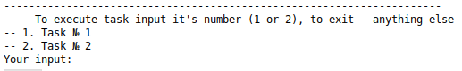
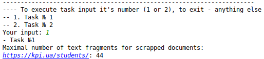
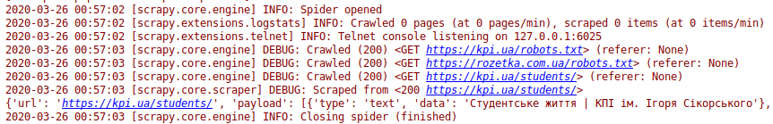
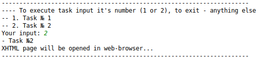
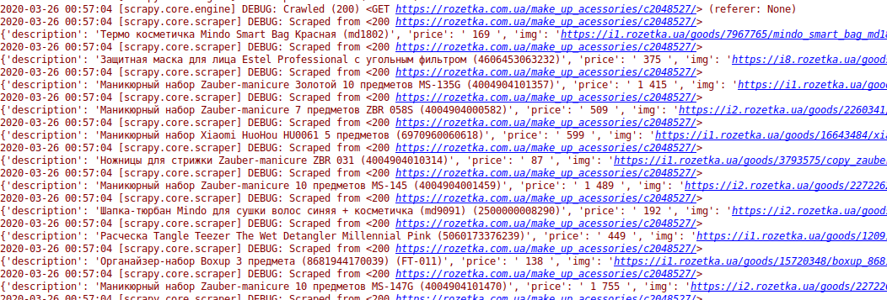
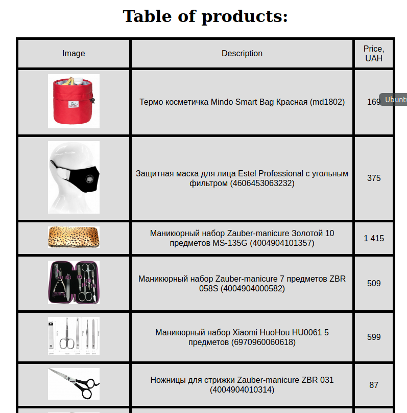

# Лабораторна робота №1. 
## Тема : Вивчення базових операцій обробки XML-документів

### Варіант завдання

1 варіант

| Базова сторінка (завдання 1) | Зміст завдання 2     | Адреса інтернет-магазину (завдання 3) |
|------------------------------|----------------------|---------------------------------------|
| www.kpi.ua         | Максимальна кількість текстових фрагментів | www.rozetka.ua |

### Приклад роботи програми

Головне меню

Перше завдання

Друге завдання

Створена таблиця