# Лабораторна робота №1. 
## Тема : Практика використання сервера Redis
## Мета : Здобуття практичних навичок створення ефективних програм, орієнтованих на використання сервера Redis за допомогою мови Python 
## Завдання та звіт
[Завдання](docs/lab2_bd2-db2019_2020.pdf)  
[Звіт](docs/Antusheva_KP-73_Lab2.pdf)  
### Виконала Антушева Марія Ярославівна, КП-73  
### Скріншоти роботи програми  
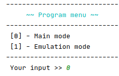  
*1. Початкове меню*  
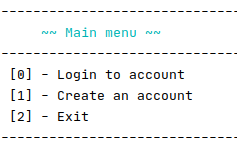  
*2. Головне меню*  
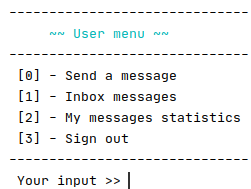  
*3. Меню користувача*  
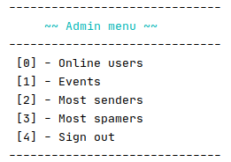  
*4. Меню адміністратора*  
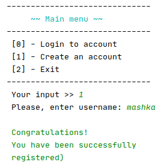  
*5. Реєстрація користувача*  
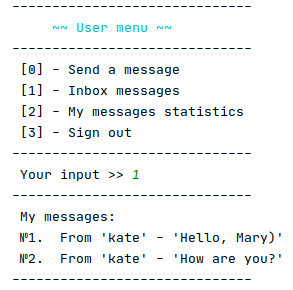  
*6. Вхідні повідомлення користувача*  
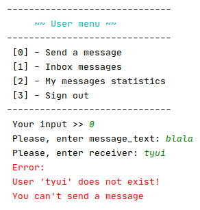  
*7. Невдала спроба користувача надіслати повідомлення*  
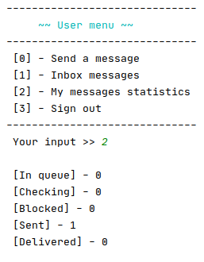  
*8. Статистика повідомлень користувача*  
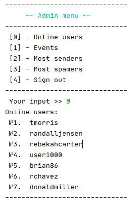  
*9. Користувачі, що знаходяться online*  
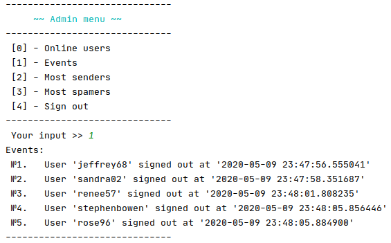  
*10. Список активностей для журналювання*  
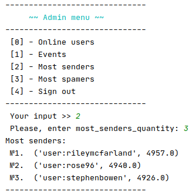  
*11. Найбільш активні відправники*  
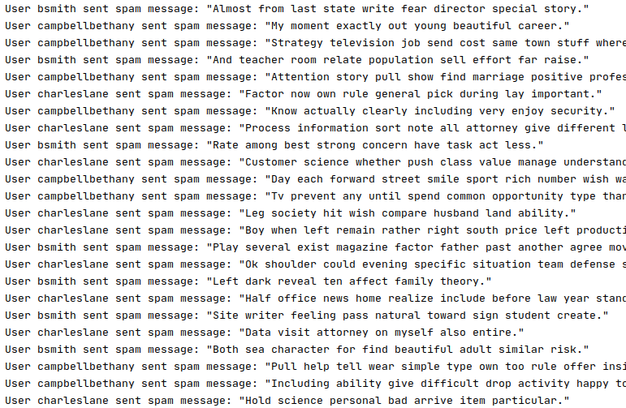  
*12. events.log*  


### Лістинг коду
```
main.py
```

```python
from src.stor.controller import Controller
from src.stor.user import UserController
from  emulation import emulation

if __name__ == "__main__":
    choice = Controller.make_choice(["Main mode", "Emulation mode"], "Program menu")
    if choice == 0:
        UserController()
    elif choice == 1:
        emulation()
```  
```
admin.py
```

```python
from src.stor.controller import Controller
from redisserv.listener import EventListener
from redisserv.redisserv import RedisServer
from menu import Menu


class AdminController(object):
    def __init__(self):
        self.serv = RedisServer()
        self.loop = True
        self.listnr = EventListener()
        self.listnr.start()
        self.start()

    def start(self):
        from data import menu_list
        try:
            menu = "Admin menu"
            while self.loop:
                choice = Controller.make_choice(menu_list[menu].keys(), menu)
                Controller.considering_choice(self, choice, list(menu_list[menu].values()))
        except Exception as e:
            Menu.show_error(str(e))


    def get_events(self):
        events = self.listnr.get_events()
        Menu.print_list("Events: ", events)

    def get_online_users(self):
        online_users = self.serv.get_online_users()
        Menu.print_list("Online users: ", online_users)

    def get_top_senders(self):
        top_senders = self.serv.get_top_senders(
            *Controller.get_func_arguments(self.serv.get_top_senders))
        Menu.print_list("Most senders: ", top_senders)

    def get_top_spamers(self):
        top_spamers = self.serv.get_top_spamers(
            *Controller.get_func_arguments(self.serv.get_top_spamers))
        Menu.print_list("Most spamers: ", top_spamers)
```  
```
user.py
```

```python
import colorama
from colorama import Fore
import atexit
from stor.controller import Controller

from menu import Menu
from redisserv.redisserv import RedisServer


class UserController(object):
    def __init__(self):
        self.serv = RedisServer()
        self.menu = 'Main menu'
        self.curr_user_id = -1
        self.loop = True
        atexit.register(self.sign_out)
        self.start()

    def start(self):
        from data import menu_list
        try:
            while self.loop:
                choice = Controller.make_choice(menu_list[self.menu].keys(), self.menu)
                Controller.considering_choice(self, choice, list(menu_list[self.menu].values()))

        except Exception as e:
            Menu.show_error(str(e))

    def registration(self):
        usernmm=self.serv.registration(*Controller.get_func_arguments(self.serv.registration))
        colorama.init()
        print(Fore.GREEN + "\n Congratulations!\n You have been successfully\n registered) " + Fore.RESET)

    def sign_in(self):
        user_id = self.serv.sign_in(*Controller.get_func_arguments(self.serv.sign_in))
        self.curr_user_id = user_id
        self.menu = 'User menu'
        print(Fore.GREEN + f"\n Good to see you again! " + Fore.RESET)
    def inbox_message(self):
        messages = self.serv.get_messages(self.curr_user_id)
        Menu.print_list("-" * 30 + "\n My messages: ", messages)

    def get_message_statistics(self):
        statistics = self.serv.get_message_statistics(self.curr_user_id)
        Menu.show_item(statistics)

    def sign_out(self):
        if self.curr_user_id != -1:
            self.serv.sign_out(self.curr_user_id)
            self.menu = 'Main menu'
            self.curr_user_id = -1

    def send_message(self):
        self.serv.create_message(*Controller.get_func_arguments(self.serv.create_message, 1),
                                           self.curr_user_id)

    

```  
```
emulation.py
```

```python

import random
from threading import Thread
from redisserv.redisserv import RedisServer
from faker import Faker
from stor.admin import AdminController
from menu import Menu


fake = Faker()

def emulation():
    fake = Faker()
    users_count = 5
    users = [fake.profile(fields=['username'], sex=None)['username'] for u in range(users_count)]
    threads = []
    try:
        for i in range(users_count):
            threads.append(EmulationController(users[i], users, users_count, random.randint(100, 5000)))
        for thread in threads:
            thread.start()
        AdminController()
        for thread in threads:
            if thread.is_alive():
                thread.stop()
    except Exception as e:
        Menu.show_error(str(e))


class EmulationController(Thread):
    def __init__(self, username, users_list, users_count, loop_count):
        Thread.__init__(self)
        self.quant_loop = loop_count
        self.serv = RedisServer()
        self.usrs_list = users_list
        self.users_quant = users_count
        self.serv.registration(username)
        self.usr_id = self.serv.sign_in(username)

    def run(self):
        while self.quant_loop > 0:
            message_text = fake.sentence(nb_words=10, variable_nb_words=True, ext_word_list=None)
            receiver = self.usrs_list[random.randint(0, self.users_quant - 1)]
            self.serv.create_message(message_text, receiver, self.usr_id)
            self.quant_loop -= 1

        self.stop()

    def stop(self):
        self.serv.sign_out(self.usr_id)
        self.quant_loop = 0

```

```
redisserver.py
```

```python
import redis
import datetime
import logging

logging.basicConfig(filename="./events.log", level=logging.INFO)


class RedisServer(object):
    def __init__(self):
        self.__r = redis.Redis(charset="utf-8", decode_responses=True)

    def registration(self, username):
        if self.__r.hget('users:', username):
            raise Exception(f"\n Unfortunately, username\n \'{username}\' already taken.\n Please, try another one)")
        user_id = self.__r.incr('user:id:')
        pipeline = self.__r.pipeline(True)
        pipeline.hset('users:', username, user_id)
        pipeline.hmset(f"user:{user_id}", {
            'login': username,
            'id': user_id,
            'queue': 0,
            'checking': 0,
            'blocked': 0,
            'sent': 0,
            'delivered': 0
        })
        pipeline.execute()
        logging.info(f"User {username} registered at {datetime.datetime.now()} \n")
        return user_id

    def sign_in(self, username):
        user_id = self.__r.hget("users:", username)

        if not user_id:
            raise Exception(f"User {username} does not exist ")

        self.__r.sadd("online:", username)
        logging.info(f"User {username} logged in at {datetime.datetime.now()} \n")
        self.__r.publish('users', "User %s signed in" % self.__r.hmget(f"user:{user_id}", 'login')[0])
        return int(user_id)

    def sign_out(self, user_id) -> int:
        logging.info(f"User '{user_id}' signed out at {datetime.datetime.now()} \n")
        self.__r.publish('users', "User '%s' signed out" % self.__r.hmget(f"user:{user_id}", 'login')[0])
        return self.__r.srem("online:", self.__r.hmget(f"user:{user_id}", 'login')[0])

    def create_message(self, message_text, receiver, sender_id) -> int:

        message_id = int(self.__r.incr('message:id:'))
        receiver_id = self.__r.hget("users:", receiver)

        if not receiver_id:
            raise Exception(f"\n User '{receiver}' does not exist!\n You can't send a message")

        pipeline = self.__r.pipeline(True)

        pipeline.hmset('message:%s' % message_id, {
            'text': message_text,
            'id': message_id,
            'sender_id': sender_id,
            'receiver_id': receiver_id,
            'status': "created"
        })
        pipeline.lpush("queue:", message_id)
        pipeline.hmset('message:%s' % message_id, {
            'status': 'queue'
        })
        pipeline.zincrby("sent:", 1, "user:%s" % self.__r.hmget(f"user:{sender_id}", 'login')[0])
        pipeline.hincrby(f"user:{sender_id}", "queue", 1)
        pipeline.execute()

        return message_id

    def get_messages(self, user_id):
        messages = self.__r.smembers(f"sent to:{user_id}")
        messages_list = []
        for message_id in messages:
            message = self.__r.hmget(f"message:{message_id}", ["sender_id", "text", "status"])
            sender_id = message[0]
            messages_list.append("From '%s' - '%s'" % (self.__r.hmget("user:%s" % sender_id, 'login')[0], message[1]))
            if message[2] != "delivered":
                pipeline = self.__r.pipeline(True)
                pipeline.hset(f"message:{message_id}", "status", "delivered")
                pipeline.hincrby(f"user:{sender_id}", "sent", -1)
                pipeline.hincrby(f"user:{sender_id}", "delivered", 1)
                pipeline.execute()
        return messages_list

    def get_top_senders(self, most_senders_quantity) -> list:
        return self.__r.zrange("sent:", 0, int(most_senders_quantity) - 1, desc=True, withscores=True)

    def get_top_spamers(self, most_receivers_quantity) -> list:
        return self.__r.zrange("spam:", 0, int(most_receivers_quantity) - 1, desc=True, withscores=True)

    def get_message_statistics(self, user_id):
        current_user = self.__r.hmget(f"user:{user_id}", ['queue', 'checking', 'blocked', 'sent', 'delivered'])
        return " [In queue] - %s\n [Checking] -" \
               " %s\n [Blocked] - %s\n [Sent] - %s\n [Delivered] - %s" % \
               tuple(current_user)
    
    def get_online_users(self) -> list:
        return self.__r.smembers("online:")

```

```
worker.py
```

```python
class Worker(Thread):

    import random
import time
from threading import Thread
import redis
from menu import Menu
class Worker(Thread):

    def __init__(self, delay):
        Thread.__init__(self)
        self.lp = True
        self.re = redis.Redis(charset="utf-8", decode_responses=True)
        self.delay = delay

    def run(self):
        while self.lp:
            message = self.re.brpop("queue:")
            if message:
                message_id = int(message[1])

                self.re.hmset(f"message:{message_id}", {
                    'status': 'checking'
                })
                message = self.re.hmget(f"message:{message_id}", ["sender_id", "receiver_id"])
                sender_id = int(message[0])
                receiver_id = int(message[1])
                self.re.hincrby(f"user:{sender_id}", "queue", -1)
                self.re.hincrby(f"user:{sender_id}", "checking", 1)
                time.sleep(self.delay)
                is_spam = random.random() > 0.6
                pipeline = self.re.pipeline(True)
                pipeline.hincrby(f"user:{sender_id}", "checking", -1)
                if is_spam:
                    sender_username = self.re.hmget(f"user:{sender_id}", 'login')[0]
                    pipeline.zincrby("spam:", 1, f"user:{sender_username}")
                    pipeline.hmset(f"message:{message_id}", {
                        'status': 'blocked'
                    })
                    pipeline.hincrby(f"user:{sender_id}", "blocked", 1)
                    pipeline.publish('spam', f"User {sender_username} sent spam message: \"%s\"" %
                                     self.re.hmget("message:%s" % message_id, ["text"])[0])
                    print(f"User {sender_username} sent spam message: \"%s\"" % self.re.hmget("message:%s" % message_id, ["text"])[0])
                else:
                    pipeline.hmset(f"message:{message_id}", {
                        'status': 'sent'
                    })
                    pipeline.hincrby(f"user:{sender_id}", "sent", 1)
                    pipeline.sadd(f"sent to:{receiver_id}", message_id)
                pipeline.execute()

    def stop(self):
        self.lp = False


if __name__ == '__main__':
    try:
        loop = True
        workers_count = 5
        workers = []
        for x in range(workers_count):
            worker = Worker(random.randint(0, 3))
            worker.setDaemon(True)
            workers.append(worker)
            worker.start()
        while True:
            pass
    except Exception as e:
        Menu.show_error(str(e))


```


